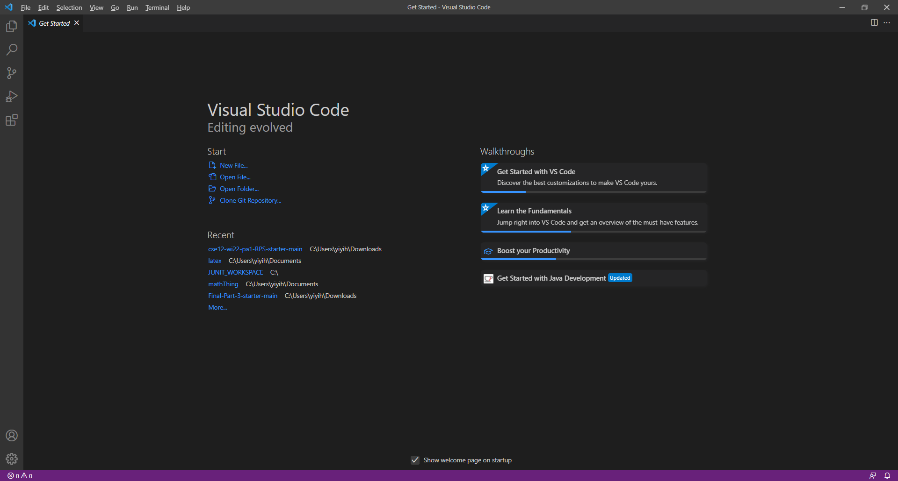
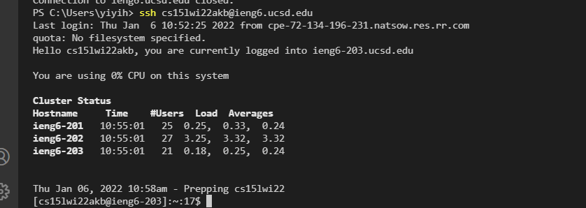
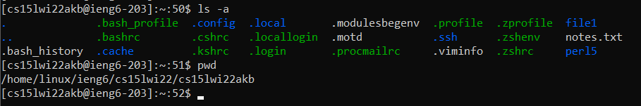
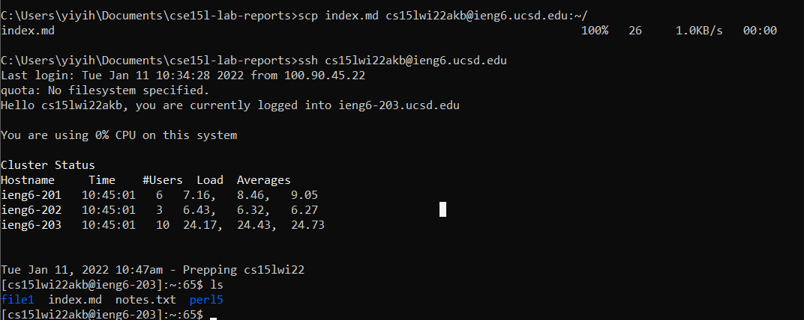
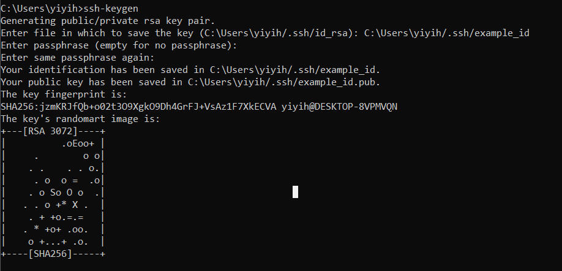
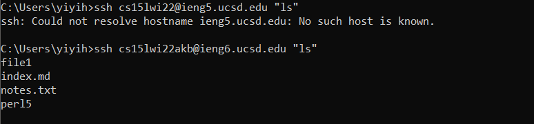

# Remote Access
## How to log onto a course-specific ieng6 account

1. ### Installing VScode

Install VScode in order to use its terminal feature and access the remote server from there. This is my installation of VScode that I downloaded from a browser.

2. ### Remotely Connecting

Use `ssh yourRemoteServer@ieng6.ucsd.edu` to connect to the remote server. Unless the user has an ssh key, the command line will prompt for a password. 

3. ### Trying Some Commands

Here are two unix commands "ls -a" and "pwd". `ls -a` gives a list of all files in the current directory. `pwd` prints the full path of the working directory.

4. ### Moving Files with `scp`

Using `scp [file] [remote server]:[directory]` moves the chosen file into the directory within the remote server. In the above image, I moved my 'index.md' file into the '~/' directory of my remote server.

5. ### Setting an SSH Key

Using `ssh-keygen` within the client and then copying that key to a '.ssh' folder on the server side will allow us to login without typing in a password every time. In the image is an example of a key that is generated through 'ssh-keygen'.

6. ### Optimizing Remote Running

There are a number of ways we can make remote running easier: a chain of commands, or using quick commands that can access the remote server. In the example above, we can type "ls" with the ssh command and quickly print the output on the client.