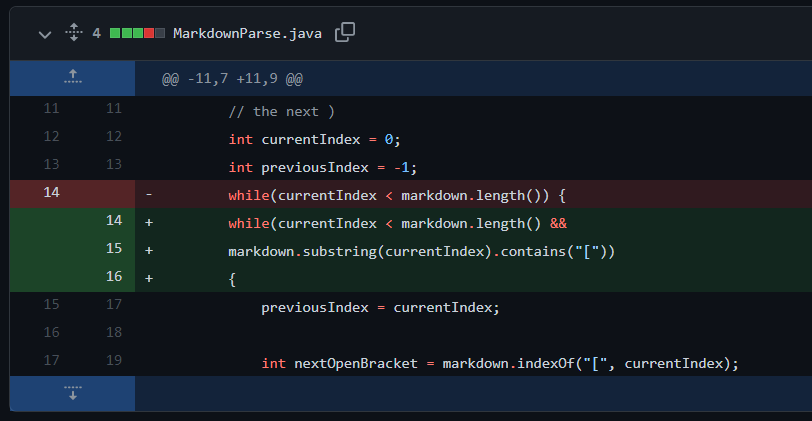

# Lab Report 2 Week 4

1. ### Code Change 1
    Input file that gave me this error: [test-file-2](https://github.com/yih365/markdown-parse/blob/main/test-file-2.md)  

    Command: ```javac -cp ".;.\libs\junit-4.13.2.jar;.\libs\hamcrest-core-1.3.jar" MarkdownParseTest.java;
                java -cp ".;.\libs\junit-4.13.2.jar;.\libs\hamcrest-core-1.3.jar" org.junit.runner.JUnitCore MarkdownParseTest
                ```  
    Error:  
        ```1) testFile2(MarkdownParseTest)
        java.io.IOException
                at MarkdownParse.getLinks(MarkdownParse.java:27)
                at MarkdownParseTest.testFile2(MarkdownParseTest.java:32)```

   My Solution:  
   

   The issue here was that the program would throw an IOException when it wasn't supposed to. This happened in the input because there was still text after the last closed parenthesis. To fix this, I added an additional condition into this 'while' loop so that the loop will exit before it will throw an exception (i.e. currentIndex will not be less than or equal to previousIndex)
  
2. ### Code Change 2
    Input file that gave me this error: [test-file-3](https://github.com/yih365/markdown-parse/blob/main/test-file-3.md)  

    Command: ```javac -cp ".;.\libs\junit-4.13.2.jar;.\libs\hamcrest-core-1.3.jar" MarkdownParseTest.java;
                java -cp ".;.\libs\junit-4.13.2.jar;.\libs\hamcrest-core-1.3.jar" org.junit.runner.JUnitCore MarkdownParseTest
                ```  
    Error:  
        ```1) testFile3(MarkdownParseTest)
java.lang.StringIndexOutOfBoundsException: begin 0, end -1, length 31      
        at java.base/java.lang.String.checkBoundsBeginEnd(String.java:3751)
        at java.base/java.lang.String.substring(String.java:1907)
        at MarkdownParse.getLinks(MarkdownParse.java:25)
        at MarkdownParseTest.testFile3(MarkdownParseTest.java:40)
        ```  

    My Solution:  
      

    The issue was the the program would attempt to get an out of bounds index of the string. This happened in this input because there were no parenthses after the brackets. To fix this, I put in an if statement that would end the while loop if any of the found indexes are -1 which means that element is not found.

3. ### Code Change 3
    Input file that gave me this error: [test-file-5](https://github.com/yih365/markdown-parse/blob/main/test-file-5.md) 

    Command: ```javac -cp ".;.\libs\junit-4.13.2.jar;.\libs\hamcrest-core-1.3.jar" MarkdownParseTest.java;
                java -cp ".;.\libs\junit-4.13.2.jar;.\libs\hamcrest-core-1.3.jar" org.junit.runner.JUnitCore MarkdownParseTest
                ```  
    Error:  
        ```1) testFile5(MarkdownParseTest)
        java.lang.AssertionError: expected:<[]> but was:<[page.com]>
                at org.junit.Assert.fail(Assert.java:89)
                at org.junit.Assert.failNotEquals(Assert.java:835)
                at org.junit.Assert.assertEquals(Assert.java:120)
                at org.junit.Assert.assertEquals(Assert.java:146)
                at MarkdownParseTest.testFile5(MarkdownParseTest.java:57)```  

    My Solution:  
     

    The issue was that the program would pick up a link from a set of parentheses that were not attached to the brackets. This does not form a link. To fix this, I made it so that the string would only be added to the list if the parentheses are right after the ending bracket.
