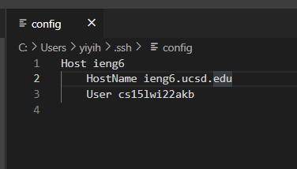
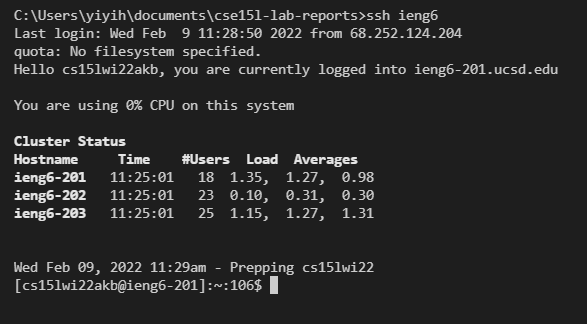
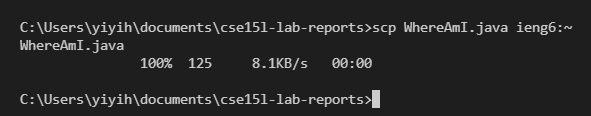

# Lab Report 3 Week 6

## Streamlining ssh configuration

1. ### .ssh/config file  
      
    I made a file named config in my .ssh folder. I then editied it through 
    VS Code and added the above lines into the file.  

2. ### ssh command using chosen alias  
      
    I can now use the command ```ssh ieng6``` to login to my ieng6 account instead of typing out my entire ieng6 account name.  

3. ### scp command using chosen alias   
      
    Copying a file to the ieng6 account using 'ieng6' instead of 'cs15lwi22akb@ieng6.ucsd.edu' also works.