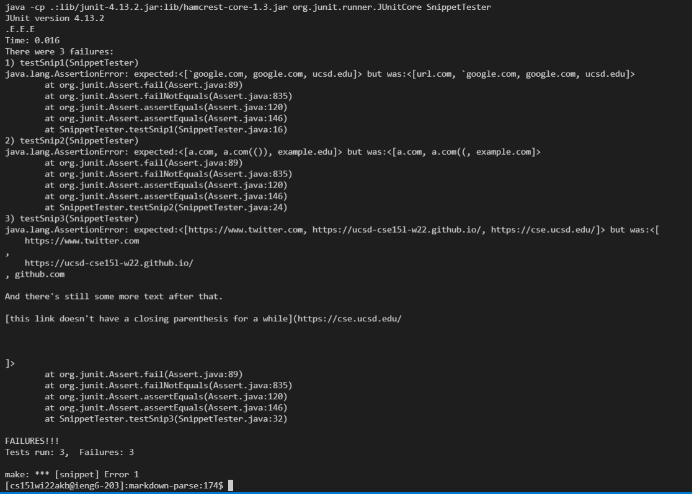
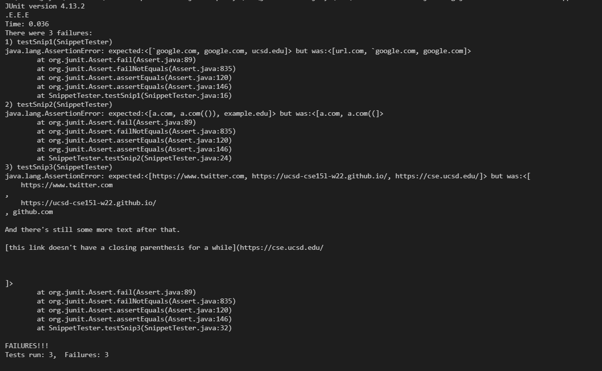

# Lab Report 4 Week 8

### My Implementation of MarkdownParse: https://github.com/yih365/markdown-parse
### Reviewed Implementation of MarkdownParse: https://github.com/IncogOwl/markdown-parse  
   
 

My tests for the code snippets:

 

My code output:

 

Other code output:

 

1. I think that a small code change will make my program work for snippet 1 and related cases with backticks. The program could check for backtick before the open bracket and backtick before the close bracket and after open bracket. Then it could move currentIndex to be after this set of brackets if such backticks exist.
2. I think that it will take a larger amount of code for the program to work with snippet2 and related cases with parentheses, brackets, and escaped brackets. I think that we can use a stack to check the corresponding open and close brackets and parentheses. However, I am not sure that it will be accomplished in <10 line changes of code since we will have to implement more condition checks to go with the stack.
3. I think this will take a lot more code to fix the program to work with snippet 3 and related cases with parentheses and brackets. For the links with line breaks within the brackets, we can check for 'https://' since this allows these examples to be a link in markdown. To deal with links without closing parenthesis, we can also use stack for this to check for corresponding parentheses. 