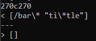

# Lab Report 5 Week 10

### Tests with different bugs
I found two tests with different bugs by saving the output of `script.sh` to a `.txt` for both MarkdownParse java files. I then used the `diff` command to check for differences between the two files.  
  
  
  

1. Test 1 (194.md)  
    [Test 194](https://github.com/ucsd-cse15l-w22/markdown-parse/blob/main/test-files/194.md) resulted in different output when put through my markdown parse compared to the given markdown parse for lab 9.  

      
    `[]` was the output for my markdown parse while `[url]` was the ouput for the other markdown parse. Neither of these inputs were correct. The expected output is `[my_(url)]`. 

      
    In my code, instead of only looking for an open parenthesis after an ending bracket, I could also look for a colon after an ending bracket and take text between the colon and the next space. So then in the example of `194.md`, we have `[Foo*bar\]]:my_(url)`, and this will return a link of `my_(url)`.

2. Test 2 (22.md)  
    [Test 22](https://github.com/ucsd-cse15l-w22/markdown-parse/blob/main/test-files/22.md) resulted in different outputs for the two markdown parse files. 

      
    `[/bar\* "ti\*tle"]` was the result from my code and `[]` was the result from the lab 9 code. Neither of these are correct because the expected output should be `[/bar\*]`.  

      
    In my MarkdownParse.java, before adding the text within the parentheses to `toReturn`, I could check for a space and text within quotations inside of the text within parenthesis; so it would check for `"ti\*tle"` in this case. Then the link would be the text after the open parenthesis and the space. 